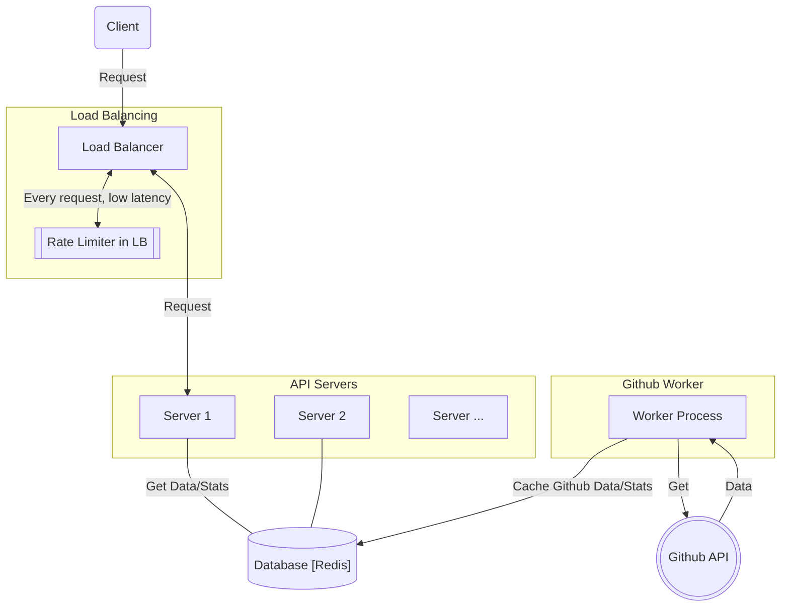
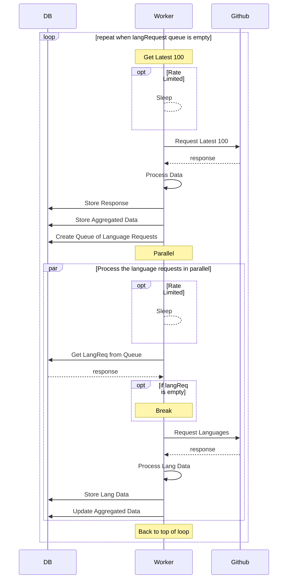

# Backend Technical Test at Scalingo - Submission by Zeno Kerr

## Task Summary [translated from the technical test pdf]

1. Return data about the last 100 public GitHub repositories. Allows you to limit the results based on different
   parameters (language, license, etc.)
2. Particular attention must be paid to performance and updating the scale of the project. The project must respond as
   quickly as possible and be able to be used by as many simultaneous users as possible.
3. Any provision put in place to make the project maintainable over time is a plus.
4. Process the results in parallel to retrieve information concerning the programming languages they use.
5. Filter data based on user search
6. Aggregate data and view statistics from Git repositories with the language selected.

_Example response:_

```json
{
  "repositories": [
    {
      "full_name": "FreeCodeCamp/FreeCodeCamp",
      "owner": "FreeCodeCamp/FreeCodeCamp",
      "repository": "FreeCodeCamp",
      "languages": {
        "javascript": {
          "bytes": 123456
        }
      }
    },
    "// ..."
  ],
  "//": "..."
}
```

# Running the application

The application is containerised and can be run using docker-compose. It is configured using environment variables

## Start the system

Using docker-compose:

```bash 
docker compose up
```

Run using docker compose with mocks and defaults:

```bash
USE_FETCHER=mock \
MOCK_FETCHER_AVG_REQUEST_SECONDS=2.5 \
MOCK_RATE_LIMIT=20 \
MOCK_RATE_LIMIT_WINDOW_SECONDS=60 \
FETCH_TIMEOUT_SECONDS=4 \
SLEEPOVER_DURATION_SECONDS=4 \
docker compose up
```

## Environment Variables

### API Server

| Variable                         | Default    | Description                                    |
|----------------------------------|------------|------------------------------------------------|
| PORT                             | 5000       | The port the API server listens on             |
| REDIS_HOSTPORT                   | redis:6379 | The HostPort of the redis database             |
| REDIS_PREFIX                     |            | The prefix for the redis database              |
| REQUEST_MEMCACHE_MAX_AGE_SECONDS | 10         | The TTL for the internal requests memory cache |

### Worker

| Variable                         | Default    | Description                                                                                                                                                                                                           |
|----------------------------------|------------|-----------------------------------------------------------------------------------------------------------------------------------------------------------------------------------------------------------------------|
| REDIS_HOSTPORT                   | redis:6379 | The HostPort of the redis database                                                                                                                                                                                    |
| REDIS_PREFIX                     |            | The prefix for the redis database                                                                                                                                                                                     |
| USE_FETCHER                      | mock       | Use the mock fetcher for testing <br/>    * **mock** - Use the mock fetcher (uses static data from the `./worker/interfaces/fetcher/mock/data` directory <br/>* **live** - Use the live fetcher (uses the Github API) |
| MOCK_RATE_LIMIT                  | 20         | The mock fetcher simulates an API rate limiter. This is the number of requests allowed per `MOCK_RATE_LIMIT_WINDOW_SECONDS`                                                                                           |
| MOCK_RATE_LIMIT_WINDOW_SECONDS   | 60         | The window for the rate limit (Max `MOCK_RATE_LIMIT` requests per window)                                                                                                                                             |
| MOCK_FETCHER_AVG_REQUEST_SECONDS | 0.5        | The average time for an API request to return in the mock fetcher (max time=avg x2)                                                                                                                                   |
| FETCH_TIMEOUT_SECONDS            | 0.98       | The timeout for fetching data from the fetcher                                                                                                                                                                        |
| SLEEPOVER_DURATION_SECONDS       | 5          | When the API rate limit is exceeded, the workers will sleep until the reset time plus this duration                                                                                                                   |

## Calling the API

```bash
curl 'localhost:5000/ping'
```

```bash
curl 'localhost:5000/repos'
```

```bash
curl 'localhost:5000/repos?language=python&license=apache&has_open_issues=true'
````

```bash
curl 'localhost:5000/stats'
```

```bash
# REPOS
# Call every second (useful for seeing the effect of the in-memory cache)
while true ; do curl -s 'localhost:5000/repos' > /dev/null ; sleep 1 ; done
```

```bash
# STATS
# Call every second (useful for seeing the effect of the in-memory cache)
while true ; do curl -s 'localhost:5000/stats' > /dev/null ; sleep 1 ; done
```

# Tests

I have written some tests for this code base, but they are not exhaustive. I have:

* written tests mock and live implementations of the fetcher.
* written tests memory and redis implementations of the database.

These tests helped with development of the parallel processing logic in the worker without hitting the Github API.
The memory implmenetation of the database could be useful for testing the API server without needing a redis instance,
however, due to time constraints the `memory` implementation of the db interface is not complete.

```bash
  # Run all tests (including Github API tests)
  #  This will use some of your rate limit
  go test ./...
```

**Skip**: use `-short` to skip the **Github API** tests

```bash
  # Run all tests (short skips Github API tests)
  go test -short ./...
```

# Further documentation

#### Diagrams in this README.md are made with Mermaid JS

* The documentation below includes diagrams created using Mermaid (https://mermaid.js.org/).
* Github supports mermaid when rendering markdown.

To view the diagrams in your IDE, please install one of the following plugins:

* **Vscode plugin**: https://marketplace.visualstudio.com/items?itemName=bierner.markdown-mermaid
* **Jetbrains plugin**: https://plugins.jetbrains.com/plugin/20146-mermaid
* **Other Options**: https://mermaid.js.org/ecosystem/integrations-community.html#productivity-tools

## Functional requirements

1. Query the Github API and return the last 100 public GitHub repositories
2. Process the results in parallel to retrieve information concerning the programming languages they use
3. Allow filtering of the results based on different parameters
4. Aggregate data and view statistics with the language selected

## Non-functional requirements

1. Must be written in go
2. Particular attention must be paid to performance and updating the scale of the project. The project must respond as
   quickly as possible and be able to be used by as many simultaneous users as possible.
3. Any provision put in place to make the project maintainable over time is a plus.
4. High quality of code and documentation

## Limiting the scope [of this exercise]

I will limit the scope of this exercise to the following:

* Use the Github unauthenticated API, which has a rate limit of 60 requests per hour.
* Allow filtering of the results based on different parameters
  * I will allow filtering on the results returned from Github.
  * I will not filter the results using the call to the Github API as this would breach the rate limit and be slow.
  * I will not implement the following as they are not required in this exercise, however I will include some of them
    in my proposed design:
    * Load Balancing
    * Rate Limiting
    * CDN Cache Headers in responses
    * Authentication
    * Tracing
    * Profiling
    * ZooKeeping / Service Registration

## Numbers and assumptions

"as many simultaneous users as possible"... Let's go with 1 million requests per minute!

* Requests per minute (RPM)
  * 1 Million RPM
  * ~17k requests per second (RPS)
* Request size:
  * 10 filter parameters @ 8 bytes each = approx 100 bytes per request
  * Data transferred:
    * 1.7 MB/s request data
* Response size:
  * Assumptions:
    * 100 repositories @ 400 bytes each = 40 KB per request
    * Aggregated Statistics:
      * 100 languages @ 32 bytes each = 3.2 KB
    * Total response size approx 50KB
  * Data transferred:
    * 850 MB/s response data (uncompressed)

## System design

When deciding on the system design we will consider the following objectives:

* Large number of requests per second... (17K RPS)
  * Horizontally scalable
  * Stateless
  * Load balancing
* Minimise bandwidth used (requests and responses) as it is costly
  * Cache request/responses
  * Local cache to reduce load on the shared cache
  * Rate limiting
    * by IP address only (no authenticated users)
    * to reduce the number of requests from malicious or naive clients
  * Efficient design of data in API
  * Appropriate cache headers in http response
* Minimise the compute power used (also costly)
  * Cache
  * Language choice (go)
  * Code efficiency

## High Level Design

A good approach to this problem is to treat the system as a set of services. Each service has a specific responsibility
and can be scaled independently* can be monitored independently.

In this application there are two main services and some supporting services:

### 1. Worker Service

The worker is an essential component of the system. It is responsible for periodically fetching the latest data from the
Github API, processing the data, and storing it in the database. It also processes the language data in parallel. It
gracefully manages the rate limits of the Github API.

* Periodically query the Github API to get the latest data
* Process the data
* Store the data

### 2. API Server Service

The API server is responsible for processing the requests from the client. It retrieves the data from the database and
returns it to the client. It also processes the requests for the aggregated statistics.

* Respond to API requests

### 3. Supporting Services:

* Load balancer [Not implemented]
  * Distribute requests to the service
* Rate Limiting in Load Balancer [Not implemented]
  * rate limiter can be horizontally scalable.
  * internal to the load balancer for low latency and highly scalable as part of cloud provider services.
  * periodically caches data to a shared cache
* Database Service
  * Store the results of the Github API calls
  * Provide aggregation logic
  * Optionally store pre-aggregated data [pre-aggregated data not implemented]
  * Options:
    * **Redis** (We'll go with redis, as it fits the task well)
      * pros: distributed and scalable, fast, recoverable
      * cons: external dependency, data limited by memory available
    * Relational DB: Postgres, MySQL
      * pros: distributed and scalable, can handle large amounts of data
      * cons: external dependency, slower than Redis
* Caching API Requests/Responses
  * Option 1: **Local in-memory cache** in each API Server instance (basic implementation as an example for
    this exercise)
  * Option 2: Cache service in local network (such as varnish)
  * Option 3: CDN Content Delivery Network (external cache)

## System Architecture



#### Why do have separate API Servers and Worker Process?

A request to the Github API is rate limited, slow and expensive. Here is the output from a curl request to Github:

```
  % Total    % Received % Xferd  Average Speed   Time    Time     Time  Current
                                 Dload  Upload   Total   Spent    Left  Speed
100  668k    0  668k    0     0   264k      0 --:--:--  0:00:02 --:--:--  264k
```

It takes 2-3 seconds to download 668k of data.

With thousands of requests per second, we don't want to make thousands of requests to the Github API. Therefore, we
cache the Github data, and update it periodically respecting the rate limits.

The **worker** is responsible for keeping the local copy of the Github data up to date.

The **API servers** are responsible for processing the `/repos` and `/stats` requests (17k RPS).

If the API Servers were also responsible for retrieving the Github data, we would need to manage locking or queuing,
which could cause contention and bugs. By separating the worker from the API servers, we can avoid this problem.

* Write once, read many times
* Single responsibility

## A few more design details

### Software Architecture

The API Server and the Worker follow _**a simplified version**_ of the clean architecture pattern.
https://blog.cleancoder.com/uncle-bob/2012/08/13/the-clean-architecture.html

In the clean architecture, the application is divided into layers:

* Entities
* Use Cases
* Interface Adapters
* Frameworks and Drivers
* External Interfaces

Within our applications, we combine 3 of the layers into a single layer for simplicity:

* Interfaces (`/interfaces`), _which contains all three_:
  * _External Interfaces_
  * _Frameworks and Drivers_
  * _Interface Adapters_
* Use Cases (`/usecases`)
* Entities (`/entities`)

### A brief explanation of the layers:

Entities
: This layer contains internal data structures and "high level policies" used by the application.

Usecases
: This layer implements the application-specific logic. In the case of the worker, we coordinate the fetching of data
from the Github API, the processing and the storage of the data. In the case of the API server, we coordinate the
processing of
requests and responses.

Interfaces
: This layer contains the external interfaces, the frameworks and drivers, and the interface adapters. The external
interfaces are the interfaces to the external services (Github API, Redis). The frameworks and drivers are the
implementations of the external interfaces. The interface adapters are the implementations of the interfaces to the
usecases.

### Overall project structure

There are two main applications: the API Server and the Worker.
They each need to be built and deployed independently, however they share some common code.

#### Directory Structure

- **/apiServer** Contains the code for the API Server
- **/worker**  Contains the code for the Worker
- **/common** Contains the common code shared between the API Server and the Worker

Both the `worker` and the `apiServer` applications have the same directory structure. The `common` code
follows a similar convention.

### Worker

The following sequence diagram shows the process of the worker.

1. Get the latest 100 public repositories from the Github API
2. Process the data
3. Store the data in the database
4. Create a queue of language requests
5. Process the language requests in parallel
6. Store the language data in the database
7. Update the aggregated data
8. Repeat



### API Server

The API server is responsible for processing the requests from the client and allows some filtering.

#### Filters

Endpoint /repos can be filtered with the following query parameters:

    * name
    * language
    * license
    * allow_forking
    * has_open_issues
    * has_projects [not implemented]
    * has_downloads [not implemented]
    * has_wiki [not implemented]
    * has_pages [not implemented]
    * has_discussions [not implemented]

#### An example filtered query

```bash
curl 'localhost:5000/repos?language=go&license=apache&has_open_issues=false'
````

#### Aggregation and Stats

The `/stats` endpoint returns the aggregated statistics for the repositories.
The data is aggregated by:

* language
* license

### Github API Curl commands

#### Search repositories

The following is a CURL command to get the last 100 public repositories:

```bash
curl -H 'Accept: application/vnd.github.json' \
-o /tmp/list.json \
'https://api.github.com/search/repositories?q=type:public&per_page=100&sort=created&order=desc'
```

#### Get languages for a repository

The following is a CURL command to gets the languages for a specific repository:

```bash
curl -v -H 'Accept: application/vnd.github.json' \
-o /tmp/languages.json \
'https://api.github.com/repos/pandas-dev/pandas-stubs/languages'
```

To exceed the API rate limit and try to get all the data at once, we can use the following command:

```bash
dir=./worker/interfaces/fetcher/mock/data
for i in `grep languages_url $dir/list.json | awk '{print $2}' | sed 's/[",]//g'` ; do \
  echo $i ; \
  file=$dir/`echo $i | sed 's,/,_,g'`.json ; \
  if [ -f $file ] ; then \
    echo "Skipping $i" ; \
    continue ; \
  fi ; \
  curl -H 'Accept: application/vnd.github.json' \
    $i -s -o $file ; \
done
```

# [Original README.md] Canvas for Backend Technical Test at Scalingo

## Instructions

* From this canvas, respond to the project which has been communicated to you by our team
* Feel free to change everything

## Execution

```
docker compose up
```

Application will be then running on port `5000`

## Test

```
$ curl localhost:5000/ping
{ "status": "pong" }
```
